**Last Updated:** 2026-04-24

# LearnOS — Architecture Reference

Comprehensive, diagram-ready description of every component, boundary, and data flow in LearnOS. Use this to drive an architecture diagram (Mermaid / Draw.io / Excalidraw / Figma) or to onboard a new engineer without asking them to read the whole codebase. Each section maps 1:1 to boxes or arrows in a diagram.

**Contents**
1. [Quick reference (the 4 questions)](#1-quick-reference)
2. [10,000-foot view](#2-10000-foot-view)
3. [Deployment target (where things run)](#3-deployment-target-where-things-run)
4. [Client architecture — Next.js 14](#4-client-architecture--nextjs-14)
5. [Backend architecture — FastAPI](#5-backend-architecture--fastapi)
6. [External AI services](#6-external-ai-services)
7. [Data stores](#7-data-stores)
8. [Protocols & channels](#8-protocols--channels)
9. [Authentication & authorization](#9-authentication--authorization)
10. [Database schema (relational map)](#10-database-schema-relational-map)
11. [Key data flows (sequence diagrams)](#11-key-data-flows-sequence-diagrams)
12. [Security boundaries](#12-security-boundaries)
13. [Observability & operations](#13-observability--operations)
14. [Ready-to-paste Mermaid diagrams](#14-ready-to-paste-mermaid-diagrams)

---

## 1. Quick reference

Four questions, short answers. The rest of the doc expands each.

| Question | Answer |
|---|---|
| Where is the **frontend** deployed? | **AWS Amplify Hosting**, built from `frontend/` on GitHub push, served behind Amplify's managed CloudFront at `app.learnos.app`. |
| Where is the **backend** deployed? | **Amazon ECS on Fargate**. Container image in **Amazon ECR**. Public entry via an **Application Load Balancer** + ACM TLS at `api.learnos.app`. |
| Where is the **database**? | **Supabase cloud** — PostgreSQL + Auth (JWT) + Storage + Realtime. Not in our AWS account. |
| How do **users come and go**? | Browser → Route 53 → Amplify (Next.js) → `/api/proxy` → ALB → ECS task (FastAPI) → Supabase. Long-lived voice + sentiment sessions follow the same path over WSS. Sign-out is client-side via `supabase.auth.signOut()`. |

```
     ┌──────────────┐           ┌────────────────┐           ┌──────────────────┐
     │  User's      │  HTTPS +  │  Frontend on   │  HTTPS +  │  Backend on      │
     │  browser     ├──────────►│  AWS Amplify   ├──────────►│  AWS ECS Fargate │
     │  (Next.js    │◄──────────┤  Hosting       │◄──────────┤  (image in ECR,  │
     │   SPA)       │           │  (Next.js 14)  │           │   behind an ALB) │
     └───────┬──────┘           └────────────────┘           └────────┬─────────┘
             │                                                         │
             │  Supabase JS SDK (HTTPS)                                 │  SQLAlchemy / asyncpg (TLS)
             │                                                         │
             ▼                                                         ▼
     ┌──────────────────────────────────────────────────────────────────────────┐
     │                          Database: Supabase cloud                        │
     │           PostgreSQL · Auth (JWT) · Storage · Realtime                   │
     └──────────────────────────────────────────────────────────────────────────┘
```

For the concrete infra plan (task sizes, ALB idle timeout for WS, Secrets Manager wiring, CI/CD, IAM, cost), see [DEPLOYMENT_AWS.md](DEPLOYMENT_AWS.md).

---

## 2. 10,000-foot view

Three bands: **Client · Backend · External**.

```
┌────────────────────────┐     ┌─────────────────────────┐     ┌─────────────────────────────┐
│       CLIENT           │     │        BACKEND          │     │    EXTERNAL / PLATFORM      │
│  Browser (Next.js 14)  │◄───►│  FastAPI app (Python)   │◄───►│  AI vendors + Supabase BaaS │
└────────────────────────┘     └─────────────────────────┘     └─────────────────────────────┘
         ▲   ▲                          ▲                                ▲
         │   │                          │                                │
    WebRTC  HTTPS              WebSocket proxies                   HTTPS / WSS
     (cam)  SSE, JSON          (voice, video)                      to third-party APIs
```

- Client runs in the browser. SSR is used only for the proxy Route Handler (`/api/proxy/[...path]`) so the browser stays same-origin with the backend.
- The backend is the **only** component that holds AI keys. Every outbound call to Anthropic / Gemini / OpenAI / YouTube goes through FastAPI.
- Supabase is the single database, auth provider, file store, and realtime broker. The frontend talks to Supabase Auth + Realtime directly with the public anon key; row-level security enforces per-student isolation.

---

## 3. Deployment target (where things run)

| Component | Runs on | Responsibilities |
|---|---|---|
| Next.js 14 SPA + `/api/proxy/*` route | **AWS Amplify Hosting** (production + staging branches, PR previews) | Serves UI, forwards `/api/proxy/[...]` to the backend so same-origin cookies work; edge cache via Amplify's CloudFront |
| FastAPI backend | **Amazon ECS Fargate** service in a private subnet, image pulled from **ECR** | REST + WS, auth verification, AI orchestration, DB writes, Gemini Live WS proxy, YouTube Data API proxy |
| Public HTTPS + WSS entry point | **AWS Application Load Balancer** with ACM cert; idle timeout raised to 3600 s for voice sessions | Terminates TLS, forwards to ECS target group on port 8000 |
| Rate-limit / cache store | **Amazon ElastiCache for Redis** (slowapi counters, future shared caches) | Private subnet, reachable from ECS only |
| Secrets | **AWS Secrets Manager** (`learnos/prod/backend`) | Injected into the ECS task at start via the `secrets` stanza |
| Logs, metrics, alarms | **CloudWatch** (Logs + Metrics) | Task logs, ALB 4xx/5xx rates, CPU/memory target scaling |
| DNS + TLS | **Route 53** + **ACM** | `app.learnos.app` (Amplify), `api.learnos.app` (ALB) |
| CI/CD | **Amplify autodeploy** for the frontend; **GitHub Actions → ECR → ECS** for the backend (OIDC, no long-lived AWS keys) | On each push, build, push, roll forward |
| Database · Auth · Storage · Realtime | **Supabase cloud** (region chosen separately from AWS region) | Authoritative state; PostgreSQL connection over TLS |

The developer loop (`npm run dev` + `uvicorn --reload`) is symmetrical at the boundary level — only the hosting changes.

---

## 4. Client architecture — Next.js 14

File root: `frontend/src/`

### 4.1 App Router routes
Arrange these as leaves under the Amplify-hosted "Next.js App" box.

| Route | Page responsibility |
|---|---|
| `/` | Landing |
| `/login`, `/register` | Auth forms (email + Google OAuth) |
| `/forgot-password`, `/auth/reset-password`, `/auth/callback` | Password reset + OAuth callback |
| `/onboarding` | Multi-step wizard — grade, board, subjects, marksheet |
| `/dashboard` | Stat cells, subject cards, next-best-action, daily challenges, arcade cabinets |
| `/learn` | Subject picker |
| `/learn/[subjectId]` | Chapter list with inline Mark-complete button |
| `/learn/[subjectId]/[chapterId]` | **Primary lesson page** (voice tutor, chat, tool-call visuals, sentiment, Mark-complete) |
| `/learn/[subjectId]/[chapterId]/activity` | Chapter quiz |
| `/practice` | Adaptive mixed quiz |
| `/review` | SM-2 flashcard reveal/rate UI |
| `/analytics` | Charts + learning profile |
| `/leaderboard`, `/buddy` | Gamification views |
| `/focus` | Mood check-in + Pomodoro |
| `/project` | AI multi-day project builder |
| `/scan` | Doubt scanner (photo → steps) |
| `/story/[chapterId]`, `/podcast/[chapterId]`, `/career/[chapterId]` | Immersive content |
| `/sim/projectile` | Canvas physics sim |
| `/parent` | Read-only parent digest |
| `/path` | Learning-path tree |
| `/courses` | Curated external courses |
| `/profile` | Account details |

### 4.2 Hooks (cross-cutting state)

| Hook | Job |
|---|---|
| `useSupabaseAuth()` | Session + user state; listens to `supabase.auth.onAuthStateChange` |
| `useVoiceChat()` | Opens the Gemini Live WebSocket via our proxy, manages mic/speaker, receives audio + transcripts, dispatches tool calls to the lesson page, enforces mic-gate + Devanagari transcript filter |
| `useVideoFeed()` | getUserMedia → canvas → JPEG frames every ~5 s |
| `useSentiment()` | Subscribes to `/api/video/sentiment/ws` for live emotion labels |

### 4.3 Client-only state that isn't in the DB
- `learnos:last-lesson` (localStorage) → dashboard's "Continue learning" tile
- Project milestone checklist (localStorage) → per-project progress
- Supabase session (cookies via `@supabase/ssr`)

### 4.4 Browser-side renderers
- `MermaidDiagram` — lazy `import("mermaid")`, renders SVG with pan/zoom; `max-width:100%; max-height:100%; width:auto; height:auto` so small diagrams don't over-stretch
- `resolveWikipediaImage(query)` — fetches `https://en.wikipedia.org/api/rest_v1/page/summary/{q}` **directly from the browser** (no backend proxy; Wikipedia is public and cacheable)
- YouTube iframe — `youtube.com/embed/{videoId}`, sandboxed, `referrerPolicy=strict-origin-when-cross-origin`, honors `start=/end=` trims

---

## 5. Backend architecture — FastAPI

File root: `backend/app/`

Four clusters: **routers**, **services**, **core**, **models**. Container entry: `uvicorn app.main:app --workers 2 --proxy-headers`.

### 5.1 Routers (HTTP / WS entry points)

| Router | Mounted at | Purpose |
|---|---|---|
| `auth.py` | `/api/auth` | JWT verify (most endpoints re-verify inline) |
| `onboarding.py` | `/api/onboarding` | POST profile + seed subjects, marksheet upload, profile/heartbeat/subjects GET |
| `curriculum.py` | `/api/curriculum` | Generate + fetch chapter lists, adjust order |
| `lessons.py` | `/api/lessons` | Chapter content, SSE chat, chat history, **POST `/complete`** |
| `voice_gemini.py` | `/api/voice` | **WS `/gemini`** — transparent proxy to Gemini Live; auth via first client message; upstream dial overlaps with JWT verification |
| `voice.py` | `/api/voice` | Legacy OpenAI Realtime endpoints — kept for reference, superseded by `voice_gemini` |
| `youtube.py` | `/api/youtube` | **GET `/search`** — server-side YouTube Data API v3 proxy for the `show_video` tool; safe-search strict, short clips only, 1 h in-process cache |
| `video.py` | `/api/video` | HTTP frame analyze + live sentiment WS |
| `activities.py` | `/api/activities` | Get, submit, evaluate chapter quizzes |
| `progress.py` | `/api/progress` | Aggregated progress & analytics |
| `notes.py` | `/api/notes` | Per-chapter freeform notes |
| `sessions.py` | `/api` | Learning session lifecycle |
| `tutor_session.py` | `/api/tutor-session` | LangGraph-style session state (legacy) |
| `learning.py` | `/api/learning` | Learning memory / adaptive profile |
| `challenges.py` | `/api/challenges` | Daily challenges + XP claim |
| `flashcards.py` | `/api/flashcards` | SM-2 deck generation + due cards + review grading |
| `leaderboard.py` | `/api/leaderboard` | Global / friends rankings |
| `parent.py` | `/api/parent` | Parent read-only digest |
| `buddy.py` | `/api/buddy` | Study-buddy state + messages |
| `immersive.py` | `/api/immersive` | Story, podcast (OpenAI TTS), career, doubt-scan |
| `wellness.py` | `/api/wellness` | Mood log + Pomodoro completion |
| `projects.py` | `/api/projects` | AI multi-day project builder |
| `suggest.py` | `/api/suggest` | Next-best-action recommender |
| `practice.py` | `/api/practice` | Adaptive mixed-topic quiz |

### 5.2 Services (business logic)

| Service | Used by | Purpose |
|---|---|---|
| `curriculum_generator.py` | onboarding, curriculum, lessons | Claude calls to build curriculum, chapter content, activities |
| `teaching_engine.py` | lessons | Streaming Socratic tutor (SSE) with emotion-aware prompt injection |
| `activity_evaluator.py` | activities | AI grading + feedback |
| `adaptive.py` | curriculum, lessons, activities | Concept-level mastery → chapter re-order + difficulty tuning |
| `sentiment_analyzer.py` | video | Claude Vision per-frame classification |
| `voice_manager.py` | legacy | Kept alongside `voice.py` — unused by `voice_gemini` |
| `flashcards.py` | flashcards | SM-2 scheduling + Claude deck generation |
| `gamification.py` | many | XP + level + streak bookkeeping, streak-freeze logic |
| `tutor_session_engine.py` | tutor_session | LangGraph state machine (legacy) |
| `session_service.py` | sessions | Learning session CRUD |
| `parent_digest.py` | parent | Weekly digest assembly |
| `syllabus_data.py` | curriculum, onboarding | Hard-coded official syllabus data per board |

### 5.3 Core

| Module | Purpose |
|---|---|
| `core/supabase_client.py` | Supabase Python SDK (service role) |
| `core/ai_client.py` | Anthropic client wrapper |
| `core/redis_client.py` | Redis connection for slowapi |
| `core/database.py` | SQLAlchemy async engine + session factory |
| `core/security.py` | `verify_supabase_jwt()` — used by the voice WS proxy (lenient JWT decode) |
| `core/rate_limiter.py` | slowapi configuration |
| `dependencies.py` | `get_current_user` FastAPI dependency (strict JWT) |

### 5.4 Models
See §10 for the ER map. Models under `models/` map 1:1 to tables; Alembic (`backend/alembic/versions/0001..0011`) is the source of truth for columns.

---

## 6. External AI services

Draw as a single "Third-party AI" cluster outside the backend.

| Service | Who calls it | Purpose | Auth |
|---|---|---|---|
| **Anthropic Claude** | `curriculum_generator`, `teaching_engine`, `activity_evaluator`, `immersive`, `projects`, `flashcards`, `sentiment_analyzer` | LLM generation + Vision | `ANTHROPIC_API_KEY` (server-side) |
| **Google Gemini Live** | `voice_gemini.py` bidirectional WS | Native-audio S2S voice tutor + tool calls | `GEMINI_API_KEY` (server-side) |
| **OpenAI TTS** | `immersive.py` (podcast) | Audio podcast generation | `OPENAI_API_KEY` (server-side) |
| **YouTube Data API v3** | `youtube.py` HTTP | `search.list` for the `show_video` tool | `YOUTUBE_DATA_API_KEY` (server-side) |
| **Wikipedia REST** | **Browser** (`resolveWikipediaImage`) | Lead image for `show_diagram` | none (public) |

Wikipedia is the only third-party edge that bypasses our backend — the call is public, cacheable, and needs no auth.

---

## 7. Data stores

| Store | Contents | Access pattern |
|---|---|---|
| **Supabase PostgreSQL** | Authoritative — all domain data (see §10) | Backend via SQLAlchemy; client never reads directly |
| **Supabase Storage** | `marksheets` bucket (onboarding uploads), `content` bucket (AI-generated diagrams/media) | Backend issues signed URLs |
| **Supabase Auth** | `auth.users` + OAuth identities | Frontend via Supabase JS SDK; backend verifies JWTs |
| **Supabase Realtime** | `postgres_changes` broadcasts on `sentiment_logs` | Frontend subscribes via `supabase.channel(...)` |
| **ElastiCache Redis** | slowapi rate-limit counters | Backend only |
| **In-process (FastAPI)** | YouTube search 1 h cache (`youtube.py`) | Backend only — per-task, not shared |
| **Browser localStorage** | `learnos:last-lesson`, project milestone checklists | Client only |

---

## 8. Protocols & channels

Every edge, labeled with what flows on it.

| From → To | Protocol | Direction | Payload |
|---|---|---|---|
| Browser → Amplify (Next.js) | HTTPS | req/res | UI bundle + `/api/proxy/*` calls |
| Amplify Next.js proxy → ALB | HTTPS | req/res | Forwarded API request with `Authorization: Bearer <JWT>` |
| ALB → ECS task (FastAPI) | HTTP (private) | req/res | Same request |
| Browser → Supabase Auth | HTTPS | req/res | Sign up / sign in / OAuth redirect |
| Browser ↔ Supabase Realtime | WSS | subscribe | `postgres_changes` events |
| FastAPI → Supabase PostgreSQL | TCP (asyncpg) | req/res | SQL |
| FastAPI → Anthropic | HTTPS + SSE | req/res + stream | Prompts, streamed tokens |
| FastAPI ↔ Gemini Live | WSS | bidirectional | Audio chunks + JSON events |
| FastAPI → YouTube Data API | HTTPS | req/res | `search.list` |
| FastAPI → OpenAI TTS | HTTPS | req/res | MP3 stream for podcast |
| Browser ↔ ALB `/api/voice/gemini` | WSS | bidirectional | Proxied Gemini frames |
| Browser ↔ ALB `/api/video/sentiment/ws` | WSS | mostly server→client | Emotion labels |
| Browser ← ALB `/api/lessons/{id}/chat` | SSE (over HTTPS) | server→client stream | Tutor tokens |
| Browser → Wikipedia REST | HTTPS | req/res | Summary JSON, lead image URL |
| Browser → YouTube iframe | HTTPS | embed | Locked sandboxed iframe |

---

## 9. Authentication & authorization

```
Supabase Auth (auth.users)           → issues a JWT (HS256 signed by JWT secret)
                │
                ▼
Browser (session in cookies via @supabase/ssr)
                │  attaches: Authorization: Bearer <JWT>
                ▼
FastAPI `get_current_user` dep       → decodes & validates JWT, returns { sub, email, role }
                │
                ▼
Supabase PostgreSQL (RLS policies)   → every table scoped to auth.uid()
```

Two verification paths in the backend:
- `app/dependencies.py::get_current_user` — strict. Used by every REST route. `HTTPBearer` + `verify_supabase_jwt`. Also accepts `X-Dev-Token: dev-bypass-auth` for local testing.
- `app/core/security.py::verify_supabase_jwt` — lenient decode (no signature check) used only by the voice WS proxy. Browsers can't set custom headers on a WS handshake, so the JWT arrives as the first WS frame (`{"auth":"<jwt>"}`).

Row-Level Security on every Supabase table keys each row to `auth.uid()`. The service role key (held in Secrets Manager, used only by the backend) bypasses RLS for admin writes like curriculum seeding.

---

## 10. Database schema (relational map)

```
auth.users ─────────────────────┐   (Supabase-managed)
    │ 1:1                        │
    ▼                            │
students ──► subjects ──► chapters ──► activities ──► activity_submissions
    │         │ 1:*         │ 1:*         │ 1:*                   │
    │         │             │             │                        │
    │         ▼             │             │                        │
    │     subject_stats     │             │                        │
    │                       │             │                        │
    │         ┌─────────────┤             │                        │
    │         ▼             ▼             │                        │
    │      concepts    chat_messages      │                        │
    │         │                           │                        │
    │         ▼                           │                        │
    │   concept_mastery                   │                        │
    │                                      │                        │
    ├──► flashcards ────► flashcard_reviews                         │
    ├──► sentiment_logs ──► tied to chapter + student               │
    ├──► student_progress ──► aggregate per (student, subject)      │
    ├──► student_notes ──► per chapter                              │
    ├──► user_chapter_progress ──► {student, chapter} → is_completed, progress_%
    ├──► mood_logs                                                  │
    ├──► daily_challenges + daily_challenge_claims                  │
    └──► tutor_sessions                                              │
```

Key invariants:
- Chapter completion has **two** representations: `Chapter.status` (per-curriculum view) and `UserChapterProgress` (per-student view). `POST /api/lessons/{id}/complete` keeps both in sync and idempotently awards +25 XP on first completion.
- `StudentProgress.chapters_completed` is a legacy aggregate the dashboard reads; `/complete` increments it the same transaction.
- Alembic versions `0001`–`0011` are the source of truth for column names — read migrations before labeling a diagram.

---

## 11. Key data flows (sequence diagrams)

Each flow is a ready-to-paste Mermaid block.

### 11.1 Register → Onboard → Dashboard

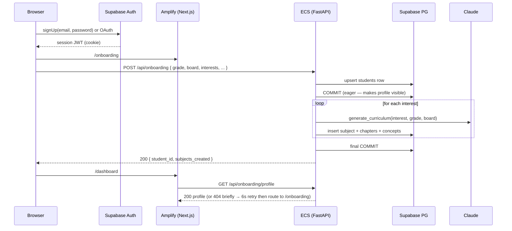

### 11.2 Lesson open → voice auto-connects → tool call → diagram + Wikipedia image

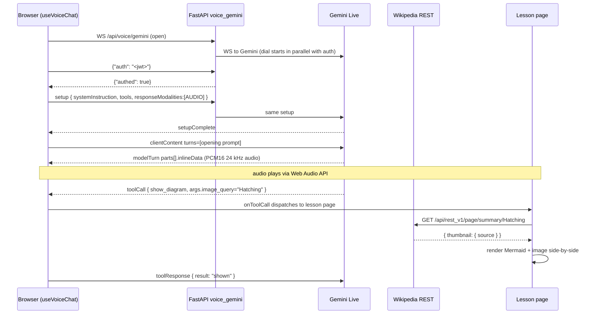

### 11.3 Video sentiment stream

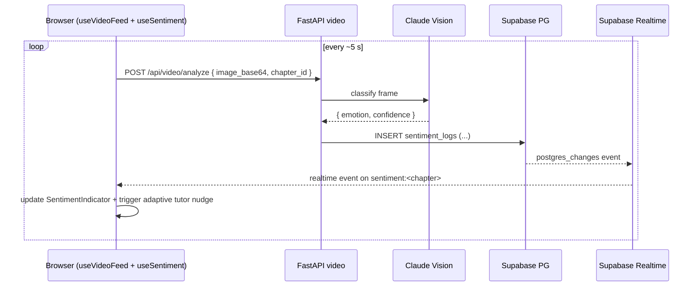

### 11.4 `show_video` tool (YouTube search)

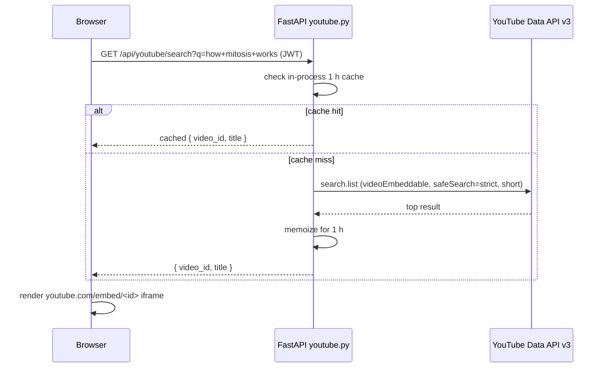

### 11.5 Quiz submission → adaptive re-order

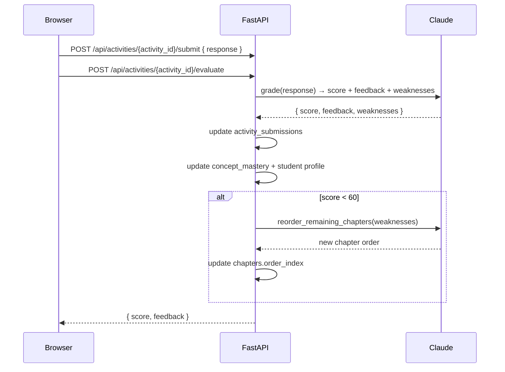

### 11.6 Chapter completion

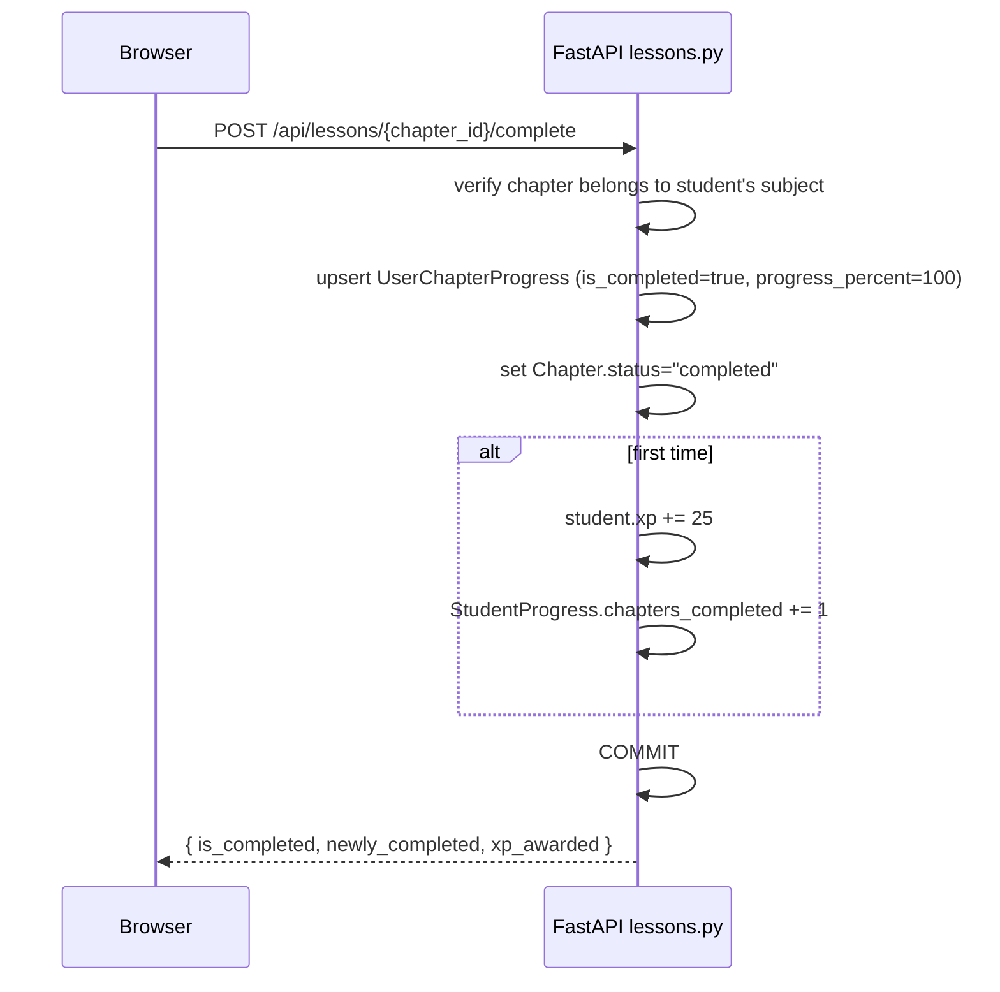

### 11.7 Flashcard SM-2 review

```mermaid
sequenceDiagram
  participant B as Browser /review
  participant BE as FastAPI flashcards

  B->>BE: GET /api/flashcards/due
  BE-->>B: [cards due today]
  loop for each card
    B->>B: show front; user reveals, rates 1–4
    B->>BE: POST /api/flashcards/{id}/review { grade }
    BE->>BE: SM-2 update interval, ease, next_due
  end
```

### 11.8 Next-Best-Action dashboard coach

```mermaid
sequenceDiagram
  participant B as Browser /dashboard
  participant BE as FastAPI suggest.py

  B->>BE: GET /api/suggest/next-best-action
  BE->>BE: gather signals (streak, due cards, mood, avg score, last check-in)
  BE->>BE: rule engine → pick up to 3 actions with priorities
  BE-->>B: [ {code, title, reason, href, priority} ]
  B->>B: render cards; top priority gets "Top pick" badge
```

---

## 12. Security boundaries

```
┌────────────────── trust boundary (server-only secrets) ──────────────────┐
│                                                                          │
│   ANTHROPIC_API_KEY   GEMINI_API_KEY   OPENAI_API_KEY   YOUTUBE_DATA_API_KEY │
│   SUPABASE_SERVICE_ROLE_KEY   SUPABASE_JWT_SECRET   SUPABASE_DB_URL      │
│                                                                          │
│   ┌───────────────┐                                                      │
│   │ ECS FastAPI   │ ─── all outbound calls to AI vendors originate here ►│
│   └───────────────┘                                                      │
│         ▲                                                                │
│         │ secrets pulled at task start                                   │
│   ┌───────────────┐                                                      │
│   │ Secrets Mgr   │                                                      │
│   └───────────────┘                                                      │
└──────────────────────────────────────────────────────────────────────────┘

    Browser           — NEVER sees the keys above
    Holds only:
      NEXT_PUBLIC_SUPABASE_URL            (public anon URL)
      NEXT_PUBLIC_SUPABASE_ANON_KEY       (anon key, RLS-enforced)
      NEXT_PUBLIC_API_URL                 (backend address)
      NEXT_PUBLIC_BACKEND_WS_URL          (WSS backend address)
      Supabase session JWT                (issued by auth; expires)
```

Enforcement:
1. **No AI SDK imports in the frontend** — `grep -r "@anthropic-ai" frontend/src` returns nothing by policy.
2. **Backend proxies** for every keyed vendor: `voice_gemini.py` (Gemini Live), `youtube.py` (YouTube Data API), `immersive.py` (OpenAI TTS), rest of backend via `core/ai_client.py` (Claude).
3. **RLS on every Supabase table** (`auth.uid() = id` style); the anon key alone cannot read other students' data.
4. **Rate limiting** on expensive endpoints — `/api/video/analyze` 60/min, curriculum generation 10/min — via slowapi + Redis.
5. **Supabase IP allow-list** pinned to the NAT gateway's Elastic IPs so only the backend can reach Postgres directly.
6. **VPC isolation** — ECS tasks and Redis live in private subnets; only the ALB has a public IP.

---

## 13. Observability & operations

- **Logs:** ECS `awslogs` driver → `/ecs/learnos-backend` CloudWatch log group, 30-day retention. Amplify has its own log group under `/aws/amplify/…`.
- **Metrics:** CloudWatch — ALB 5xx count, target response time p95, ECS CPU/memory, `UnHealthyHostCount`, ElastiCache CPU.
- **Alarms:** page on-call when ALB 5xx > 10 / 5 min, or `UnHealthyHostCount` > 0 for 3 min; warn when p95 > 2 s.
- **Scaling:** ECS target-tracking on CPU 60 %, min 2 / max 10 tasks; ALB idle timeout 3600 s for long voice sessions.
- **CI/CD:** Amplify autodeploy on push; GitHub Actions OIDC → ECR + ECS deploy for the backend; Alembic migrations run in the same workflow before the ECS update.
- **Rollback:** ECR keeps immutable SHA-tagged images → redeploy any prior image via one CLI command; Amplify keeps build history for one-click rollback.

Full details in [DEPLOYMENT_AWS.md](DEPLOYMENT_AWS.md).

---

## 14. Ready-to-paste Mermaid diagrams

### 14.1 System context (C4 Level 1)

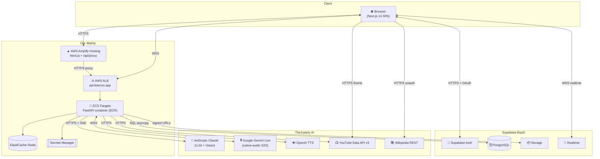

### 14.2 Backend container view (C4 Level 2)

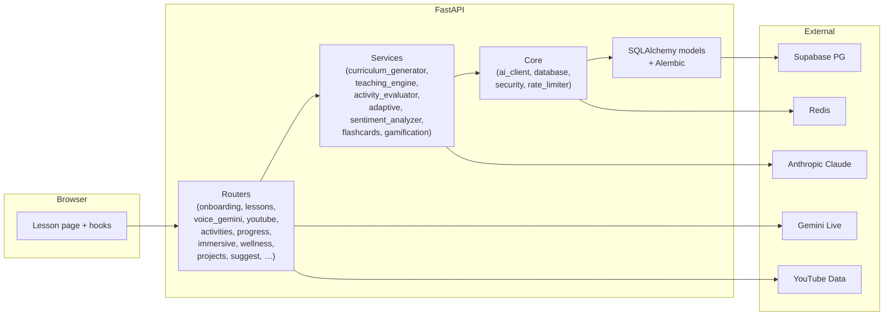

### 14.3 Voice tutor internal state machine

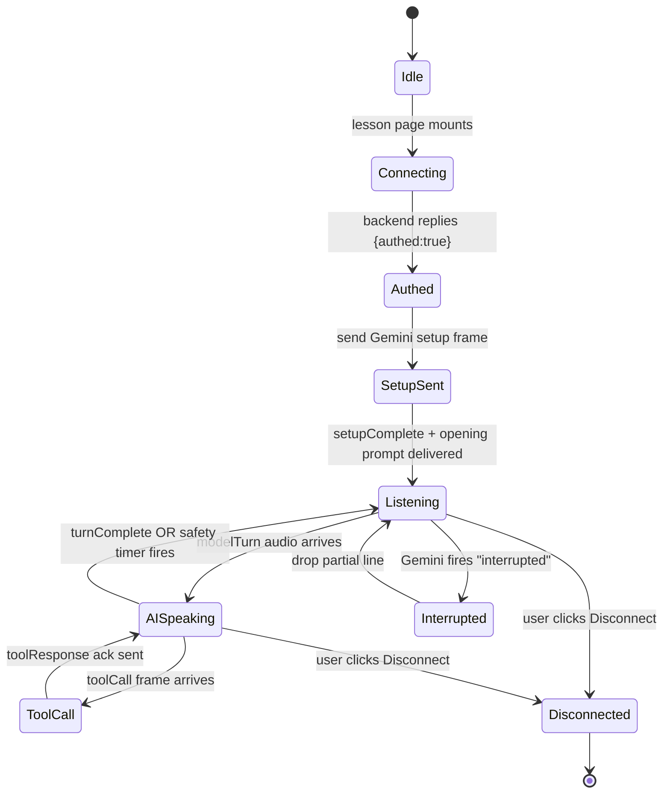

### 14.4 Database ER (condensed)

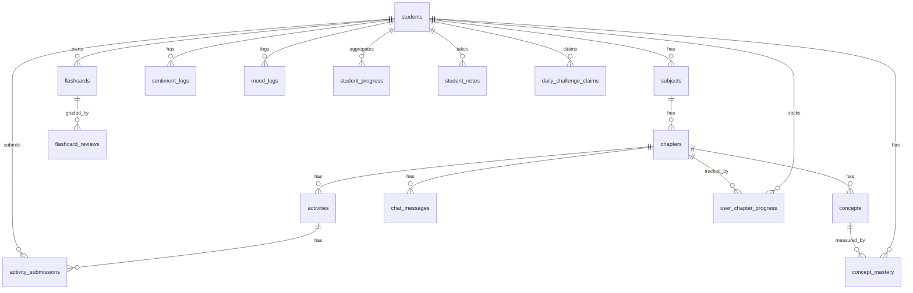

### 14.5 Deployment (what runs where)

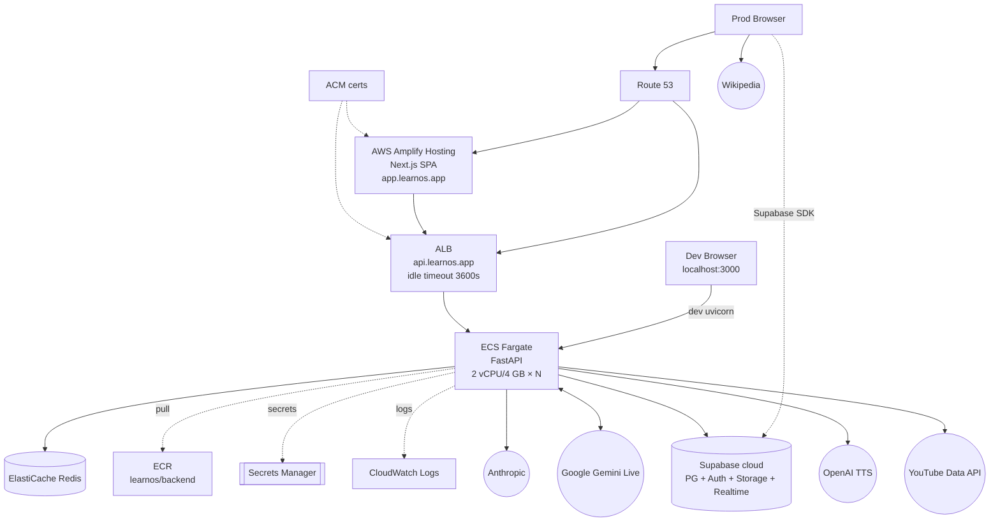

---

**How to use this doc to draw a diagram:**
1. Pick a level — C4 L1 (system context), L2 (containers), or L3 (components). §14.1 gives L1; §14.2 gives L2; §14.5 is the deployment view; §5 expands L3.
2. For any flow a stakeholder asks about, copy the matching Mermaid block from §11 into Mermaid Live / Notion / GitHub markdown preview.
3. When the system changes, update the matching row in §4, §5, §8, or §10 — every arrow in an up-to-date diagram traces back to one of those four sections.

*See also: [README.md](../README.md) for feature coverage · [CLAUDE.md](../CLAUDE.md) for route-level detail · [PROJECT_TREE.md](../PROJECT_TREE.md) for project layout · [DEPLOYMENT_AWS.md](DEPLOYMENT_AWS.md) for the concrete AWS deployment plan.*
